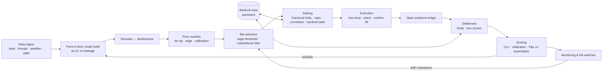

# Velocity — Real-Money Wagering System Plan

**Status:** Plan (v0.1) — approved direction: build toward real money, MLB + football in parallel, plan-first.
**Predecessors:** `DESIGN.md` (modelling philosophy), `LAUNCH.md` (operator runbook for the research slate).
**Scope of this doc:** the phased plan to take Velocity from a *validated research rig* to a *real-money operating system* across MLB (in-season now) and NFL/NCAAF (season ~6 weeks out), and the gates that must be cleared before any capital is at risk.

---

## 1. What this phase is, and what changed

Everything so far answered one question: *does the model have edge?* The measure was CLV, deliberately, because closing-line value predicts long-run profit far more reliably than a short realized-ROI sample. We now have a **positive CLV signal** on the tradeable markets and honest calibration discipline around it.

This phase answers a different, harder question: **can that edge survive contact with real money?** That is not the same problem. The model is roughly 40% of a real system. The other 60% — out-of-sample durability, execution, bankroll governance, account longevity, monitoring, compliance — is largely greenfield and is where most "profitable backtest" projects quietly die.

So the operating principle for this phase: **treat the edge as real but thin and perishable, and build the machine that protects it.**

---

## 2. Guiding principles

1. **CLV first, P&L second — but P&L is the eventual judge.** We keep optimizing to beat the close, because it's the leading indicator. But real money means realized ROI, net of vig, slippage, and fees, is what actually accrues. We hold both in view and never let a good CLV story excuse a losing P&L we can't explain.
2. **No capital before out-of-sample.** Every tuning to date (game shrink 0.35, prop shrink 0.5, `total_bases` exclusion) is in-sample on one ~15-day window. In-sample numbers are hypotheses, not settings. They must clear an untouched window before they price a real bet.
3. **The edge is thin and perishable.** Sharp markets are ~efficient; our edge is measured in a few points of CLV, not double-digit ROI. A few percent of execution slippage or one bad correlation assumption can erase it. Every component is designed to lose as little of the edge as possible.
4. **Account survival is a first-class constraint.** Books limit and close winning accounts. A "profitable" strategy that gets limited to $5 stakes in three weeks is not a system. Staking, market selection, and book rotation are designed around longevity, not just per-bet EV.
5. **Everything is measured and reversible.** Live CLV, calibration drift, feed health, and P&L-vs-expectation are tracked continuously, with automated kill-switches. We can always answer "is the edge still there?" and stop fast if not.
6. **Legal and within-ToS only.** Licensed books, correct jurisdiction, KYC, tax, and responsible-gambling limits are non-negotiable inputs, not afterthoughts (§12).

---

## 3. Where we stand (honest inventory)

| Layer | State | Gap to real money |
|---|---|---|
| Per-PA / play sim → distribution | **Built, tested** (MLB) | Football sim not yet ported |
| De-vig / edge / fractional-Kelly | **Built, tested** | Correlation-aware staking is basic |
| CLV + calibration scoring | **Built, tested** | — |
| Walk-forward backtest (point-in-time) | **Built, ran** | Single window / single season only |
| Confidence calibration (shrink, per-market, exclusion) | **Built, tuned** | **In-sample only** |
| Live slate (game + props) | **Wired** | No execution, no bankroll state, no monitoring |
| Line archive / CLV backfill | **Built** (private artifacts) | Batch (hourly GH Actions), not real-time |
| Execution (placing bets) | **None** | Entire layer greenfield |
| Bankroll & staking governance | **Per-slate only** | No persistent bankroll, drawdown control, or unit policy |
| Monitoring / alerting / kill-switches | **None** | Entire layer greenfield |
| Accounts / book management / compliance | **None** | Entire layer greenfield |

The takeaway: **the analytics are the mature part; the *system* around them barely exists.** That's normal, and it's why we plan before building.

---

## 4. The three gates before real money

No capital is staked until all three pass. Each has explicit, pre-registered criteria so we can't move the goalposts after seeing results.

### Gate 1 — Out-of-sample validation *(the go/no-go)*
Bank a second, untouched window (a different MLB stretch; ideally a different month, and eventually a second season) and re-run the walk-forward **with the frozen in-sample settings** (0.35 / 0.5 / exclude `total_bases`).
- **Pass:** CLV stays positive on the tradeable markets at similar magnitude; calibration (ECE) holds; the `total_bases`-style no-edge findings replicate. Realized ROI need not be positive, but must be within the variance band implied by the CLV.
- **Fail:** CLV collapses or flips, or calibration falls apart → the edge was overfit. Back to modelling, no money.

### Gate 2 — Forward paper-trading CLV
Run the live loop for a defined period (target: 3–4 weeks MLB, and the NFL preseason + first weeks) **logging every bet and its true closing line, staking nothing.**
- **Pass:** forward CLV over ≥N logged bets is positive and consistent with backtest; feed/latency issues that only show up live are shaken out; the bets we *could actually get down* (at real available prices/limits) still carry edge.
- **Fail:** live CLV materially below backtest → execution/latency/price-availability is eating the edge. Fix before capital.

### Gate 3 — Execution proof
Place a small number of **real, minimum-stake** bets to measure the gap between modelled price and filled price (slippage), limit behaviour, and settlement/record-keeping end to end.
- **Pass:** slippage is bounded and the net-of-slippage edge is still positive; the full loop (select → place → settle → CLV/P&L record) works with real tickets.
- **Fail:** we can't reliably get the modelled prices, or limits gut the strategy → rethink market selection and book set.

Only after Gate 3 does staking scale up, and even then gradually (§7).

---

## 5. Target architecture — the operating loop

What exists today: **A→D and the J scoring**. What's new or immature: **E–I, K, and the persistent bankroll state L.** The plan below builds those out while hardening A–D.

---

## 6. Workstreams (run in parallel)

### Track A — Model hardening & validation (MLB, now)
The in-season proving ground; feeds Gates 1–2.
1. **Second-window backfill + out-of-sample re-run** (Gate 1). Re-tune *nothing* first — freeze and test. Only if it passes do we consider a joint re-fit across both windows.
2. **Fix or drop `total_bases` properly.** It's excluded live, but the *why* (the ball-in-play double/triple/HR split is unpredictable game-to-game) is a model weakness worth a real attempt: better BIP priors, batted-ball data, or accept exclusion permanently.
3. **Widen market coverage** deliberately (F5, team totals, alt lines) — each earns its place only by clearing the same CLV/calibration bar, per-market.

### Track B — Football vertical (NFL/NCAAF port) — *deadline-driven*
NFL regular season is ~6 weeks out; preseason sooner. This track has a real clock.
1. **Port the sim abstraction** to football (drive/play-level distribution → GameSim-compatible arrays, so the wagering stack is inherited unchanged, exactly as MLB did).
2. **Data ingest** on the free-tier stack already scoped in `DESIGN.md` (nflverse, CollegeFootballData) + the odds feed.
3. **Backfill a football CLV archive** early so a walk-forward exists *before* Week 1 — otherwise the first season is untested live betting, which violates Gate 1.
4. **Reuse the entire MLB harness** (backtest, calibration, per-market sweep, exclusion). The process is the transferable asset; MLB was the template.

### Track C — Operational system (the missing 60%)
1. **Persistent bankroll state** — a durable ledger of bankroll, open positions, and realized P&L that staking reads and settlement writes (today staking is stateless per slate).
2. **Execution layer** — start **manual-assisted**: the system emits a ranked, line-shopped ticket list with exact stakes; a human places them and records fills. Automate later only if it's warranted and within ToS.
3. **Line shopping** across books — the same bet at the best available number/price; track which book filled and at what.
4. **Monitoring & kill-switches** — rolling live CLV, calibration drift, feed staleness, and P&L-vs-expectation bands, with automated *stop staking* triggers.

### Track D — Risk, accounts, compliance
1. **Bankroll & staking policy** written and enforced in code (§7).
2. **Account/book strategy** for longevity (§11 account risk).
3. **Compliance checklist** — jurisdiction, KYC, tax, ToS, responsible-gambling limits (§12), signed off before Gate 3.

---

## 7. Bankroll & staking governance

The single fastest way to blow up with a real edge is bad sizing. Rules, enforced in code, not judgement:

- **Fractional Kelly, capped.** Full Kelly is too aggressive under model uncertainty and correlation. Start at a small fraction (e.g. ¼-Kelly or less) with a hard per-bet cap (% of bankroll).
- **Correlation-aware group caps.** Bets within a game (a total, its team totals, correlated props) share a cap — already modelled per-slate; must persist across the real bankroll.
- **Drawdown kill-switch.** If bankroll draws down past a pre-set threshold, staking auto-halts pending review — a drawdown past the model's expected band is evidence the edge may be gone, not a dip to ride.
- **Unit discipline & rounding** to real stake increments; never exceed a book's limit or a self-imposed max.
- **Bankroll is one number, tracked continuously** (state L), reconciled against actual book balances.
- **Edge haircut for uncertainty.** Because settings are in-sample, we stake as if the edge is smaller than measured until out-of-sample and forward data justify sizing up.

## 8. Execution layer

The gap between the price you model and the price you *get* is where thin edges die.

- **Bet-time ≠ model-time.** We price on a snapshot; the line we can actually take may have moved. The system flags stale prices and re-checks at place-time.
- **Line shopping is part of edge.** Half a point or a few cents of price, systematically, is a meaningful fraction of a thin edge.
- **Manual-assisted first.** Emit a ranked ticket list (market, side, number, max stake, book, modelled vs current price); a human executes and logs fills. This is lower-risk, ToS-safe, and shakes out real availability before any automation is considered.
- **Slippage is measured, every bet.** Filled price vs modelled price is a tracked metric; if net-of-slippage edge goes non-positive, that market is dropped.

## 9. Monitoring, metrics & kill-switches

We must always be able to answer "is the edge still there?" and stop fast if not.

- **Rolling live CLV** by market — the leading indicator; a sustained drop is the first warning.
- **Calibration drift** — live ECE vs backtest; a model drifting out of calibration is silently overconfident again.
- **Feed & latency health** — stale odds, missing lineups, or a dead stats feed must alarm, not silently mis-price.
- **P&L vs expectation band** — realized P&L plotted against the variance band implied by the staked edges; outside the band, down *or* up, is a signal to investigate, not celebrate.
- **Automated kill-switches** — drawdown, CLV collapse, or feed failure auto-halt staking.

## 10. Data & infrastructure

- **Today:** batch collection on GitHub Actions (hourly odds, per-3h lines) → private artifacts; `artifacts/` gitignored; paid data never in the public repo. Good enough for research and backfills.
- **Real money needs closer-to-real-time** odds at bet-time and a persistent store (bankroll state, open positions, fills) that outlives an Actions run. This likely means a small always-on service or scheduled near-real-time job plus a durable datastore — scoped in Track C, not before it's needed.
- **Secrets** stay in the secret manager; keys never logged or committed (existing discipline).

## 11. Risk register

| Risk | Consequence | Mitigation |
|---|---|---|
| **Model overfit** (in-sample settings) | Edge isn't real; lose money | Gate 1 out-of-sample; edge haircut; frozen-settings test |
| **Execution slippage** | Thin edge erased at fill | Slippage tracked per bet; line shopping; drop markets that don't clear net |
| **Account limiting/closure** | Strategy un-runnable at scale | Longevity-aware market/book selection; stake discipline; book rotation |
| **Correlation blow-up** | Concentrated loss on "independent" bets | Correlation-aware group caps across the real bankroll |
| **Feed failure / stale data** | Silent mispricing | Feed-health monitors; kill-switch; place-time re-check |
| **Bankroll drawdown past edge band** | Ruin risk | Fractional Kelly, hard caps, drawdown kill-switch |
| **Regulatory / ToS** | Frozen funds, legal exposure | §12 compliance sign-off before Gate 3 |

## 12. Compliance & legal (operator responsibility, not legal advice)

Sports wagering is legal in many jurisdictions and prohibited or restricted in others; this varies by country and, in the US, by state, and it changes. Before any real money:

- **Confirm it's legal** in the operator's jurisdiction and that the chosen books are **licensed** there.
- **KYC / identity / age** requirements are met honestly.
- **Taxes** on winnings are understood and recorded (the system's P&L ledger supports this).
- **Book Terms of Service** are respected — including rules on automated placement, which is why execution starts manual-assisted.
- **Responsible gambling:** pre-set loss limits, never stake money that can't be lost, and the drawdown kill-switch doubles as a discipline mechanism.

This is an analytics-and-operations plan; it is not legal or tax advice. The operator is responsible for lawful operation.

## 13. Sequenced roadmap

Rough order and dependencies. The football clock (~6 weeks to NFL) forces Track B to start immediately in parallel, even though MLB validation leads the go/no-go.

**Now → 2 weeks**
- A1: Bank a second MLB window; run the **frozen-settings out-of-sample** walk-forward → **Gate 1**.
- B1: Start the **football sim port** and data ingest (deadline-driven; can't wait for Gate 1).
- C1: Design + build **persistent bankroll state** (needed by every later step).
- D1: Draft the **bankroll/staking policy** and **compliance checklist**.

**2 → 5 weeks**
- A: If Gate 1 passes, begin **forward paper-trading** (Gate 2) on MLB.
- B2: **Football CLV backfill** so a walk-forward exists before Week 1; run the MLB harness on it.
- C2: **Execution ticket list + line shopping + slippage logging** (manual-assisted).
- C3: **Monitoring + kill-switches** wired to the paper-trading loop.

**5 → 8 weeks (into NFL season)**
- Gate 3: **small real-money execution proof** (MLB first, then football once its own Gate 1/2 clear).
- Football forward paper-trading through preseason/early weeks.
- Scale staking **gradually** only as forward data justifies (§7 edge haircut lifts as evidence accrues).

**Ongoing**
- Periodic re-tune across accumulated windows; per-market coverage expansion behind the CLV bar; continuous monitoring.

## 14. Open decisions (what I need from you)

1. **Bankroll & risk appetite** — starting bankroll, max fraction per bet, drawdown kill threshold. These set the staking policy concretely.
2. **Jurisdiction & books** — where you'll operate and which licensed books, so line-shopping and execution target the right price set (and compliance is real, not abstract).
3. **Football priority split** — NFL only, or NFL + NCAAF from the start? NCAAF doubles data/coverage work on the same clock.
4. **Execution posture** — confirm manual-assisted first (recommended), vs wanting automated placement sooner (higher ToS/account risk).
5. **Validation patience** — how many forward paper-trading bets / weeks before Gate 2 is "passed"? This trades speed-to-money against confidence.

---

*This is a living plan. Each track produces its own PRs against the same gate discipline that got us here: point-in-time correctness, CLV-first validation, and nothing tuned on data it was tested on.*
